# zgrzyt-ai

**Live demo:** [zgrzyt.mbielinski.com](https://zgrzyt.mbielinski.com)

A retrieval-augmented question-answering system for the Polish podcast **ZGRZYT**. It searches
the podcast transcripts, generates grounded answers and links sources to the relevant moment on
YouTube.

Behind the chat is an automated pipeline that downloads new episodes, transcribes them on an
on-demand GPU, lets an operator label speakers and keeps the Qdrant index up to date.

The Kubernetes and AWS configuration lives in the companion
[homelab repository](https://github.com/mikolajbielinski/homelab).

## How it works

1. A Kubernetes CronJob downloads new episodes from YouTube.
2. Completed audio is synchronized to S3.
3. An orchestrator starts the GPU worker when transcription work is waiting.
4. WhisperX transcribes and diarizes the audio; an operator assigns real speaker names.
5. Labeled transcripts are chunked, embedded and indexed in Qdrant.
6. The API combines vector and full-text search and generates an answer with timestamped sources.

```mermaid
flowchart LR
    youtube([YouTube]) --> download[Download CronJob]
    download --> s3audio[(S3 audio)]
    s3audio --> gpu[GPU transcription]
    gpu --> transcripts[(S3 transcripts)]
    transcripts --> speakers[Speaker labeling]
    speakers --> embed[Embedding CronJob]
    embed --> qdrant[(Qdrant)]
    qdrant --> backend[FastAPI]
    backend --> frontend[React]
    frontend --> cloudflare[Cloudflare Tunnel]
    cloudflare --> user([User])
```

## Key design choices

- **Durable workflow state:** S3 prefixes represent each processing stage, so jobs can restart
  without an in-memory queue.
- **Human-in-the-loop labeling:** speaker identities are confirmed before transcripts enter the
  search index.
- **Hybrid retrieval:** semantic vector search is combined with exact full-text matching for
  names and specific phrases.
- **Idempotent indexing:** deterministic Qdrant point IDs allow jobs to be rerun safely.
- **Cost-aware compute:** the GPU instance stays stopped until transcription work is available.
- **Private API boundary:** only the frontend is published through Cloudflare; the backend remains
  internal to the cluster and is protected by a NetworkPolicy.

## Components

| Directory | Responsibility | Stack |
|---|---|---|
| `download/` | Discover and download podcast audio | Python, yt-dlp, ffmpeg |
| `orchestrator/` | Derive pipeline state, control the GPU worker and send notifications | Python, boto3 |
| `speakers/` | Human speaker-labeling interface | Next.js, React, Bun |
| `embed/` | Chunk transcripts, create embeddings and update Qdrant | Python, OpenAI, tiktoken |
| `backend/` | Hybrid retrieval and grounded answer generation | FastAPI, OpenAI, Qdrant |
| `frontend/` | Chat interface and same-origin API proxy | React, Vite, nginx, Bun |

## Delivery

Pull requests run component-specific tests, linting, formatting and container builds. Images are
published to GHCR, pinned by digest in the homelab repository and deployed to k3s through Renovate
and Flux.