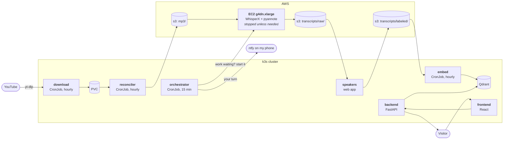

# zgrzyt-ai

A question-answering bot over the Polish podcast **ZGRZYT**. You ask it something, it finds the
moments in the show where that was actually discussed, and answers with quotes and links that
jump straight to the right second on YouTube.

The interesting part is not the chatbot — that is a few hundred lines of FastAPI. It is the
pipeline behind it: 363 episodes of audio that have to be downloaded, transcribed on a GPU,
attributed to the right speaker, chunked, embedded and kept in sync, running unattended on a
mini PC in my flat for a few dollars a month.

The infrastructure that runs all of this lives in a separate repository:
[homelab](https://github.com/mikolajbielinski/homelab).

## How an episode gets in

Each stage is a separate container that does one thing, and none of them talk to each other.

## S3 is the database

There is no Postgres here, and no queue. **An object's prefix in S3 is its state**, and every
component works out what to do by subtracting one prefix from another:

| Prefix | Meaning |
|---|---|
| `mp3/` | audio is available |
| `transcripts/raw/` | transcribed, speakers still anonymous (`SPEAKER_00`, `SPEAKER_01`) |
| `transcripts/labeled/` | a human has said which speaker is who — ready to be embedded |
| `failed/` | transcription failed; the loop moved on and left a note with the reason |
| `notified/`, `alerted/` | markers so I get told about an episode once, not every 15 minutes |
| `logs/` | the full transcription log, uploaded even when the run crashes |

So "what still needs transcribing" is literally `mp3/ − raw/ − labeled/ − failed/`, and "what
needs embedding" is the set of IDs in `labeled/` that Qdrant has not seen. Nothing has to be
remembered between runs.

## The components

| Directory | What it does | Stack | Runs as |
|---|---|---|---|
| `download/` | Fetches the newest episode from the channel and converts it to MP3 | Python, yt-dlp, ffmpeg | CronJob, hourly |
| `orchestrator/` | Decides whether the GPU machine should be awake; sends notifications | Python, boto3 | CronJob, every 15 min |
| `speakers/` | Web app where I put a name to each anonymous speaker | Next.js 16, React 19, Bun | Deployment |
| `embed/` | Chunks labelled transcripts, embeds them, upserts into Qdrant | Python, tiktoken, OpenAI | CronJob, hourly |
| `backend/` | Retrieval and answer generation | FastAPI | Deployment |
| `frontend/` | Chat UI | React 19, Vite, Tailwind 4, Bun | Deployment, behind nginx |

Two more pieces live in the homelab repo rather than here, because they are configuration and
not code: the **reconciler** (an `aws-cli` container that syncs the PVC to S3) and the
**transcription script** that runs on the GPU instance as `user_data`.

Every image is built by `.github/workflows/docker-build.yml`, which uses path filters so a
change in `backend/` does not rebuild the other five.

### download

Nothing clever, the component downloads newest podcast episode.

### reconciler

`download` writes to a PVC; `reconciler` syncs that PVC to `s3://zgrzyt-ai/mp3/` an hour later.
It skips any file modified in the last 20 minutes, because ffmpeg may still be writing it and a
truncated MP3 in S3 becomes a permanently failed episode downstream. It mounts the volume
`readOnly` and its IAM user cannot delete anything.

### orchestrator

The only component that touches EC2. Every 15 minutes it:

1. Works out whether anything still needs transcribing, and if so starts the GPU instance
   (`ec2:StartInstances` — the instance already exists, so this is idempotent, unlike creating one).
2. Pushes a notification when an episode is waiting for me to label speakers, exactly once.
3. Alerts on anything that landed in `failed/`.
4. Alerts if the instance has been running longer than 10 hours, using `LaunchTime` from
   `DescribeInstances` rather than keeping its own state — the answer comes from AWS and
   survives a pod restart.

Its IAM user can start and stop instances only where `ec2:ResourceTag/Name = zgrzyt-ai`.

### GPU transcription

WhisperX `large-v3` with pyannote diarization on a `g4dn.xlarge`. The machine is stopped by
default and shuts itself down when the queue is empty. Roughly **12 minutes per episode**.

### speakers

WhisperX gives you `SPEAKER_00` and `SPEAKER_01`, not names. Mapping them is a judgement call —
you have to listen — so this is a deliberate manual gate rather than a heuristic, and nothing
gets embedded until it has been through it. The app shows the next unlabelled transcript with a
few example utterances per speaker, and writes the result to `transcripts/labeled/`.

### embed

Chunks are built along **speaker turns**, not fixed windows: consecutive segments from the same
person are merged into one utterance, and utterances are packed up to 500 tokens with the last
one carried into the next chunk for overlap

`text-embedding-3-large`, 3072 dimensions, cosine distance, upserted in batches of 100.

### backend

Retrieval is hybrid, and the query expansion step matters more than I expected. The user's
question first goes to a chat model that returns three paraphrases plus a list of exact key
phrases. The paraphrases are embedded and searched by vector; the key phrases go through
Qdrant's full-text index. Results are merged and deduplicated by point ID.

The reason is that pure vector search is bad at proper nouns. If someone asks about a product
mentioned by name once, semantic similarity will return three episodes that are *about* that
topic and miss the sentence that actually says it.

The answer is then generated over the retrieved chunks with a system prompt that requires
quoting and forbids inventing anything not in the context. Every chunk carries its YouTube ID
and start offset, so citations come back as timestamped links.

There is a rate limiter — per IP and global per day — because the endpoint is public and
OpenAI bills me. The daily window rolls at 17:00 Warsaw time rather than midnight.

## Numbers
| | |
|---|---|
| Audio in `mp3/` | 363 episodes |
| Embedded and searchable | 354 |
| Waiting for me to label speakers | 12 |
| Transcription | ~12 min per episode on `g4dn.xlarge`
| Fixed AWS cost | ~$8/month for the 100 GiB EBS volume, billed whether the instance runs or not |
| Budget alarm | $30, alerting at 85% — leaves room for roughly 30 GPU hours a month |

## Trade-offs and known gaps

- **Images are tagged `:latest`.** Deploying is a manual `rollout restart` and there is no record
  of which build is live. CI already emits `sha-` tags; the manifests just do not use them yet.
- **The tests are not run in CI.** Every component has basic unit tests, but the workflow builds
  images without running them.
- **Auth in the speakers app is weak** — the session token is `base64(secret:user)` and routes
  only check that the cookie exists. It sits behind HTTP Basic Auth in `proxy.ts`, which is what
  actually protects it. The right fix is an identity proxy in front, not more cookie logic.
- **The rate limiter lives in process memory.** A pod restart resets the counter and a second
  replica would not share it. Fine at one replica; not a design that scales.
- **CORS is `*`** on a public API.
- **`raw/` has no history.** The 351 migrated transcripts only exist in `labeled/`, because the
  migration wrote there directly. The transcription script therefore computes "already done"
  from three prefixes rather than two — a small thing that would be confusing without this note.
